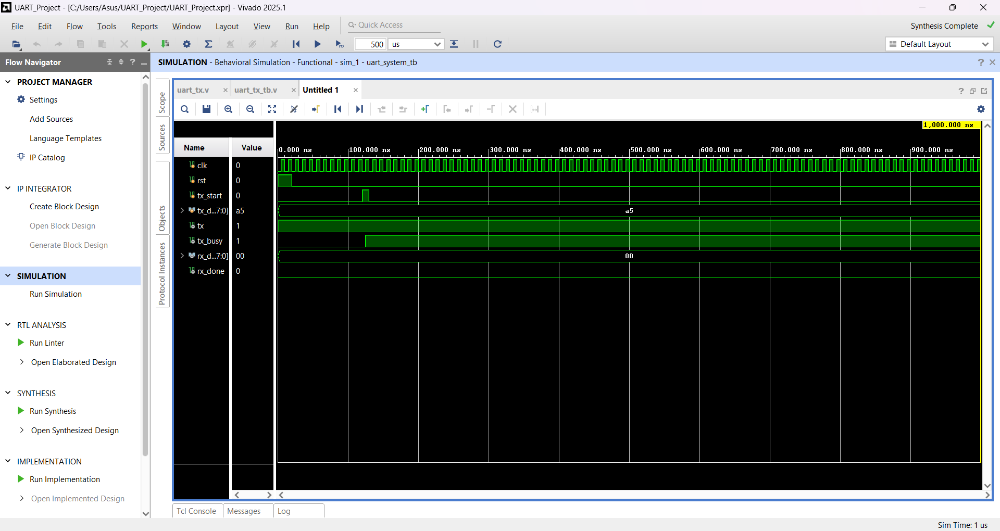
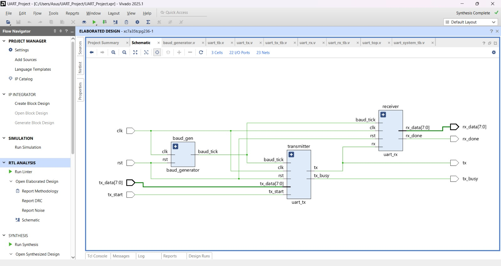
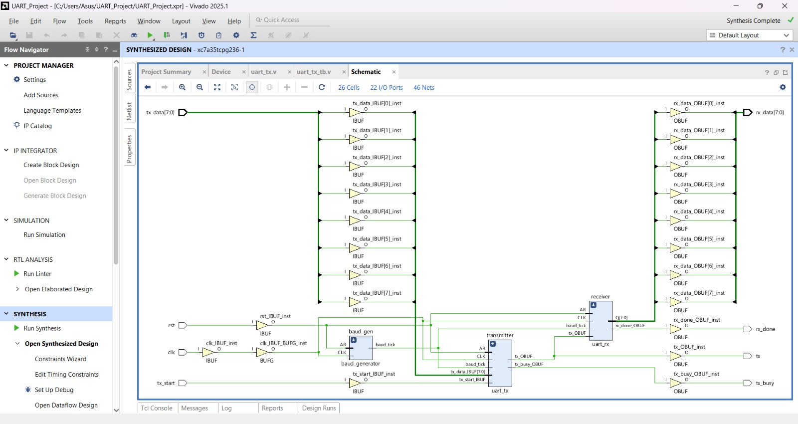

# UART Transmitter Verilog

## Overview

This project implements a UART (Universal Asynchronous Receiver Transmitter) communication system using Verilog HDL. The design includes a UART Transmitter, UART Receiver, and Baud Rate Generator. The functionality was verified through simulation in Xilinx Vivado and synthesized for FPGA implementation.

---

## Features

- UART Transmitter
- UART Receiver
- Baud Rate Generator
- 8-bit Data Transmission
- Simulation using Verilog Testbench
- RTL Design
- Synthesized Design

---

## Tools Used

- Verilog HDL
- Xilinx Vivado 2025.1

---

## Project Files

- `rtl/` – Verilog RTL source files
- `uart_tx_tb.v` – Testbench
- `waveform.png` – Simulation waveform
- `rtl_schematic.png` – RTL schematic
- `synthesized_schematic.png` – Synthesized schematic

---

## Simulation Waveform

---

## RTL Schematic

---

## Synthesized Schematic

---

## Author

**Sahil Abbas**
